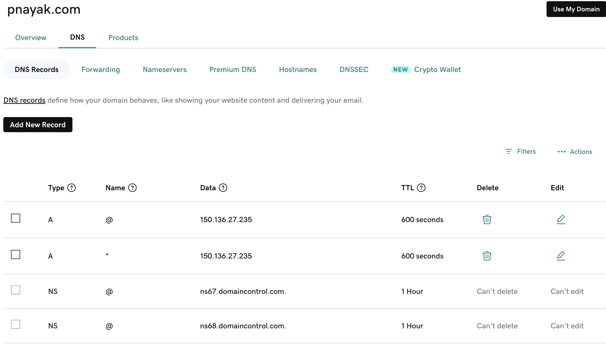
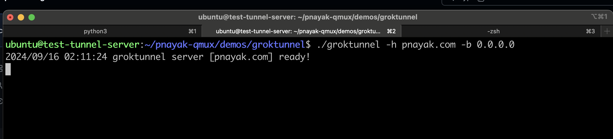
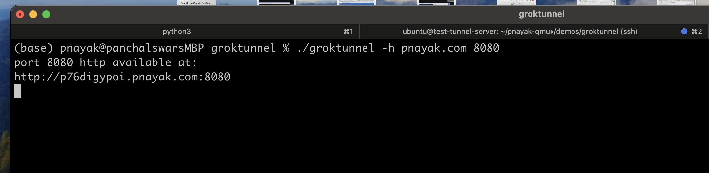

# groktunnel

Expose localhost HTTP servers with a public URL

### How to create ngrok like Tunnel

This is a demo of creating a ngrok like service using some local commands

1. first create a Server on a Cloud or any where with a Public IP
2. Have a domain name i.e "pnayak.com" and change the DNS records i.e the A record to pint to the created server 

i.e Type : A , Name : @ , Data: <Public IP> if the public IP of the server is <Public IP>

3. Create another A Record 

Type : A , Name : * , Data: <Public IP>



## Build the go app groktunnel
```
$ go build
```

## Try it out

First we run the groktunnel on the cloud server. Normally this would be run on a server, but by default uses `pnayak.com`
for a hostname which resolves all of its subdomains to this server's <public IP>.
```
$ ./groktunnel -h pnayak.com -b 0.0.0.0
2024/09/16 01:20:07 groktunnel server [pnayak.com] ready!
```



Now run a local web server. Here is how to run a server listing a file directory with Python:
```
$ python3 -mhttp.server 8080
Serving HTTP on :: port 8080 (http://[::]:8080/) ...
```

Then we run groktunnel as a client by giving it the local port to expose.
```
$ ./groktunnel -h pnayak.com 8080
port 8080 http available at:
http://delontd88n.pnayak.com:8080
```


That address should serve the same content as the local web server on 8000. For added effect,
run both client and server with `-p 80`, which will require root to run the server.

## About

This uses qmux between the client and server to tunnel subdomain requests down to the client.
This is done over a hijacked http connection after a tunnel is established and a new subdomain
vhost is setup. 

Not counting dependencies, this whole system is done in under 150 lines. This is the 5th or 6th
implementation of this system since the original [localtunnel](https://github.com/progrium/localtunnel)
in 2010, which was then cloned many times. It was then commercialized by [Ngrok](https://ngrok.com/).